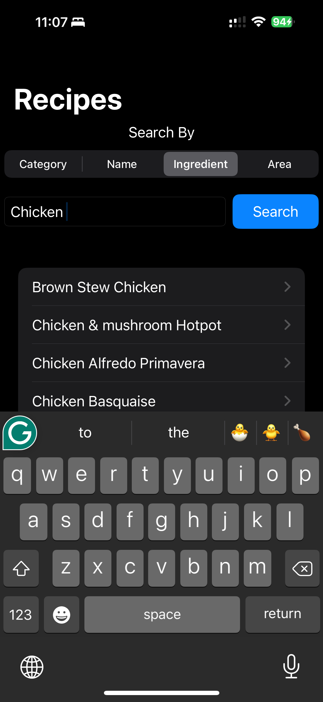
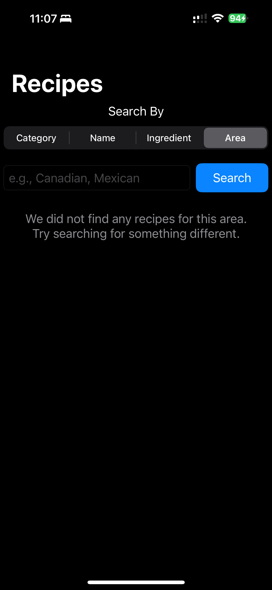
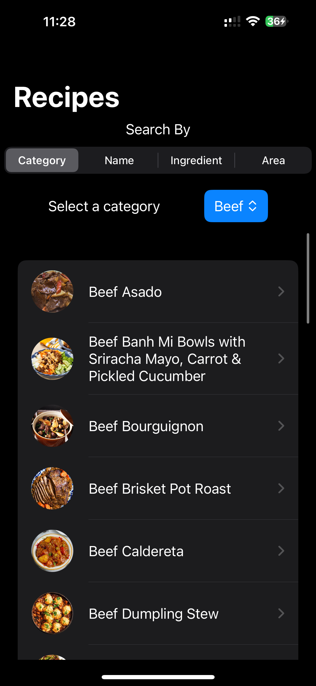
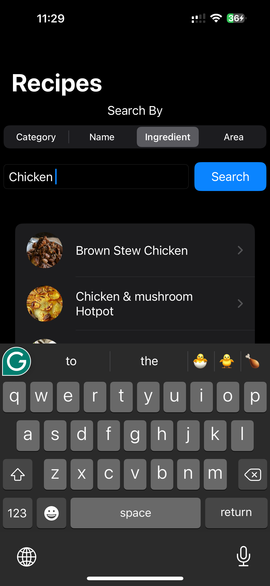
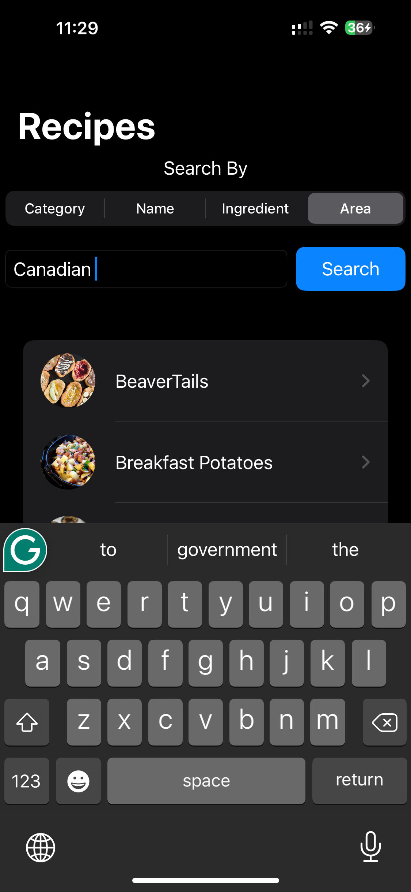
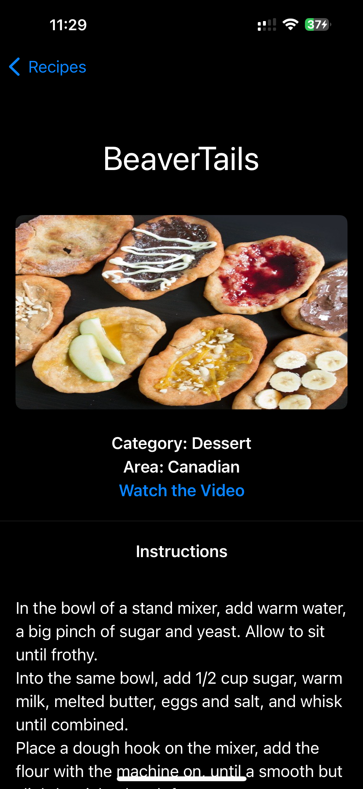
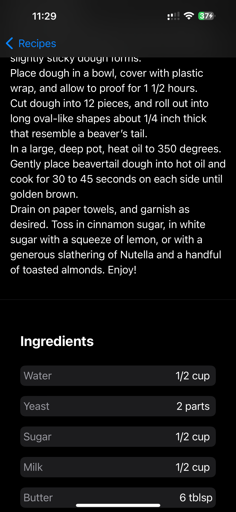
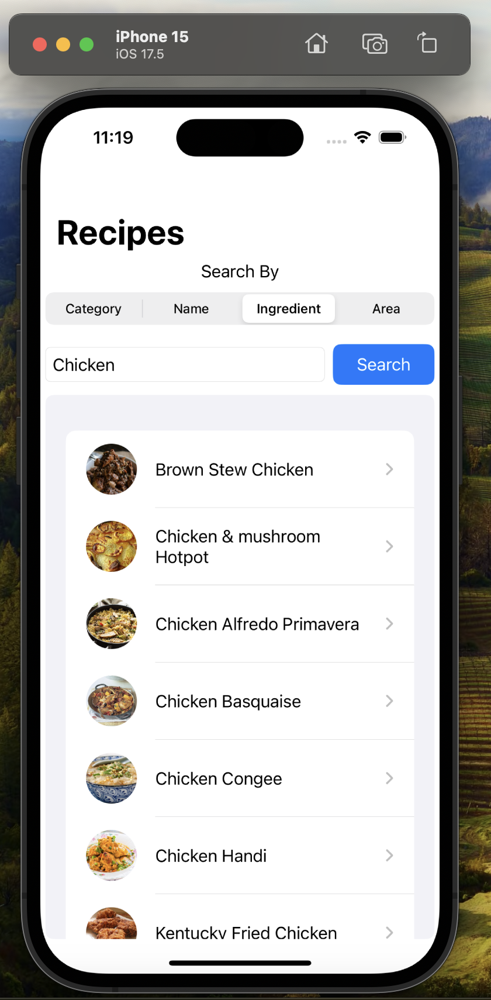
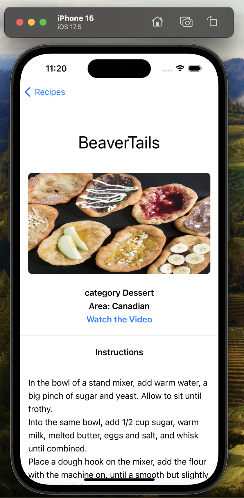
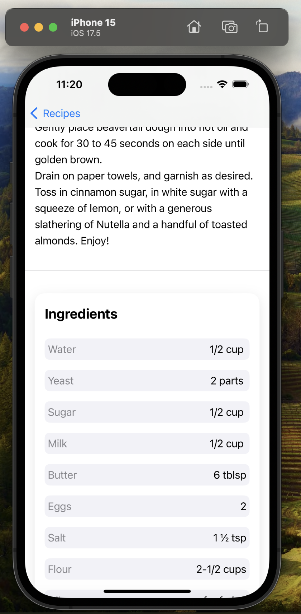

## Screenshots

### Dark Mode Design

    
    
    
    
    
    
    
    
    

### Light Mode Design

    
    
    
    
    
    
    
    
    
    

## Overview

This app is a comprehensive recipe application built using the MVVM (Model-View-ViewModel) architecture. It supports dynamic font sizes, accessibility features, high contrast modes, and localization. The app also includes network functionality with Moya, state management with Combine, and dependency injection for better scalability and testability.

## Key Features

### Architecture

- **MVVM (Model-View-ViewModel):** Ensures a clear separation of concerns, making the app scalable and maintainable.

### UI/UX

- **Dynamic Font and Accessibility Support:** Adjusts to the user's preferred font sizes and supports high contrast mode for better readability.
- **Dark Mode and Light Mode:** Fully supports both dark mode and light mode, automatically adapting to the system settings.
- **Localization:** Prepared for localization. To add another language, include the necessary translations in the localization files.
- - **Landscape and Portrait Support:** The app is designed to work seamlessly in both landscape and portrait orientations.

### Networking

- **Moya for Network Requests:** Provides a clean and structured way to interact with APIs.
  - **API Endpoints:**
    - Fetch Meal List by Category
    - Fetch Meal Details by ID
    - Fetch Meal List by Name
    - Fetch Meal List by Ingredient
    - Fetch Meal List by Country
    - Fetch Categories

### State Management

- **Combine:** Handles asynchronous events and data streams efficiently.

### Connectivity

- **Reachability:** Detects internet connectivity and automatically refreshes data when an internet connection is restored.

### Dependency Injection

- **Dependency Injection:** Utilized to inject dependencies, making the app more modular and easier to test.

## API Endpoints

The app uses several endpoints to fetch meal data:

- **fetchMealListByCategory(category: String):** Fetches meals filtered by category.
- **fetchMealDetailsByID(mealID: String):** Fetches details of a meal by its ID.
- **fetchMealListByName(name: String):** Fetches meals filtered by name.
- **fetchMealListByIngredient(ingredient: String):** Fetches meals filtered by ingredient.
- **fetchMealListByCountry(country: String):** Fetches meals filtered by country.
- **fetchCategories():** Fetches a list of meal categories.

## Dependencies

- **Moya:** Used for making network requests.
- **Combine:** Used for managing asynchronous data streams and events.
- **Reachability:** Used for monitoring network connectivity.
- **SwiftUI:** Used for building the user interface.
- **Kingfisher:** Utilized for efficient image loading and caching.

## App Modules

### ViewModels

- **MealsViewModel:** Manages the state and logic for fetching and displaying meals.
- **MealDetailViewModel:** Manages the state and logic for fetching and displaying meal details.

### Views

- **MealsListView:** Displays a list of meals and allows users to search by category or name.
- **MealDetailView:** Displays detailed information about a selected meal.
- **SearchOptionPicker:** Allows users to select a search option (by name or category).
- **CategoryPickerView:** Displays a picker for selecting meal categories.
- **SearchTextFieldView:** Displays a search text field for querying meals.
- **IngredientsListView:** Displays a list of ingredients for a selected meal.

## Testing

### Unit Tests

### Models
- **MealsResponseTests:** Validates the parsing and integrity of meal response models.
- **MealDetailsTests:** Ensures the correctness of meal detail models.
- **CategoriesResponseTests:** Verifies the categories response model data and parsing.

### ViewModels
- **MealsViewModelTests:** Tests the logic for fetching and managing meals.
- **MealDetailViewModelTests:** Validates the logic for handling meal detail data.

### Utilities
- **StringLocalizationTests:** Checks the correctness and availability of localized strings.
- **AppDependenciesTests:** Verifies the setup and configuration of app dependencies.

### Services
- **MyApiTests:** Tests API service interactions and response handling.
- **NetworkServicesTests:** Ensures the reliability and correctness of network service functionalities.

### UI Tests

- **LaunchScreenViewUITests:** Verifies that the launch screen displays correctly and transitions smoothly to the main view.

